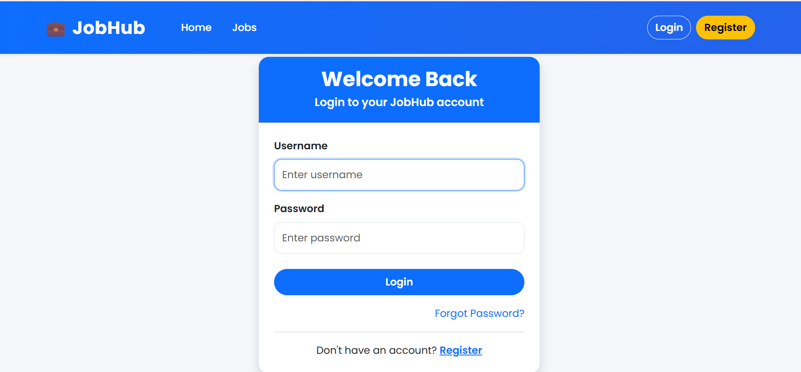
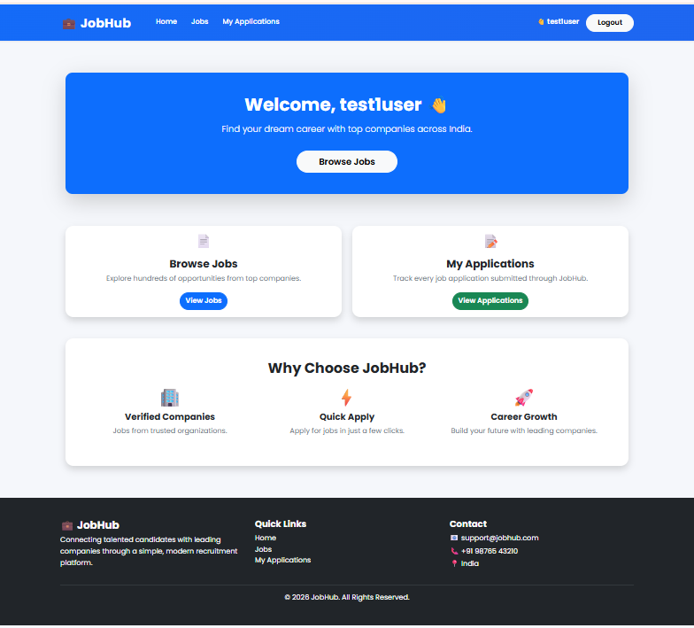
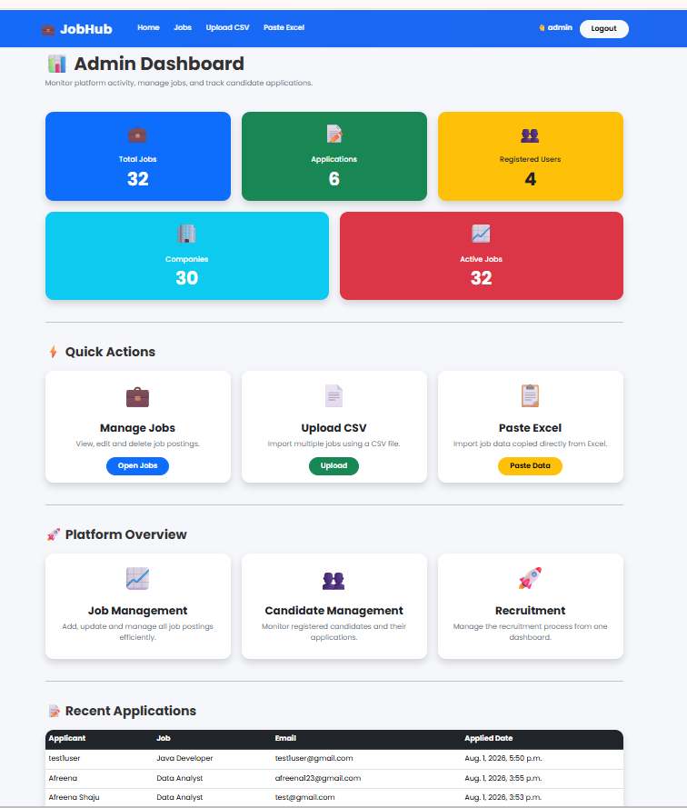
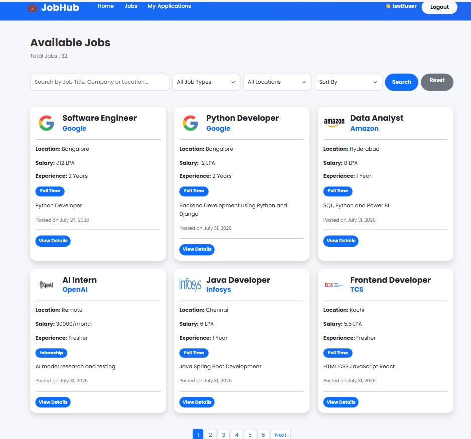
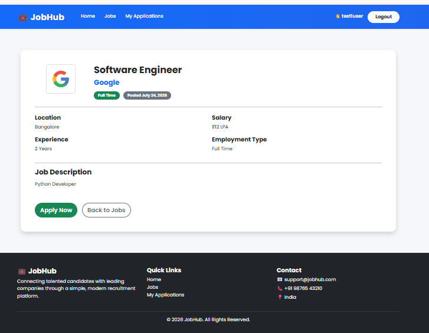
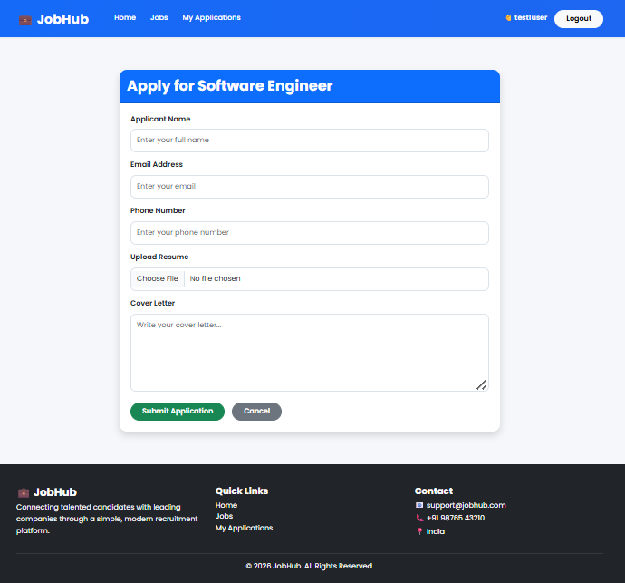
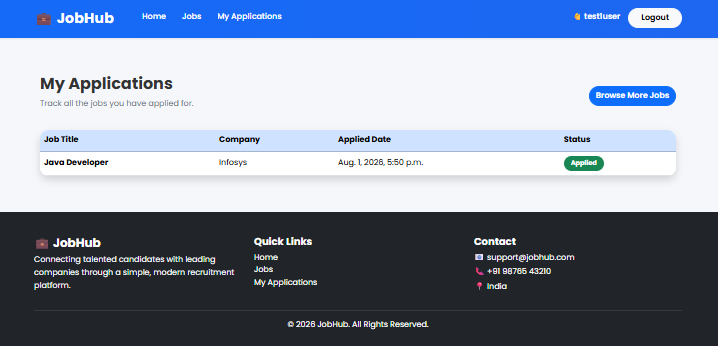
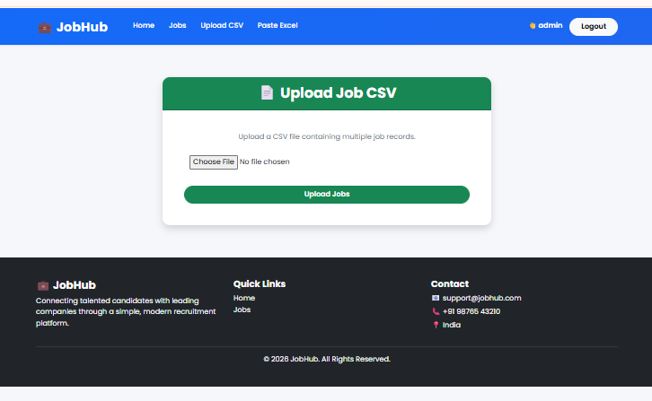
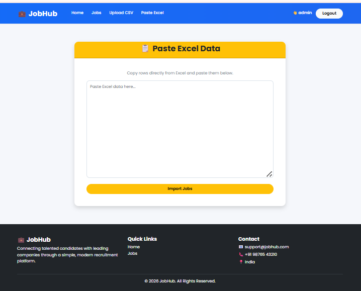

# JobHub – Full Stack Job Portal using Django

## Project Overview

JobHub is a Full Stack Web Application developed using **Django**, **MySQL**, **HTML**, **CSS**, and **Bootstrap**. The application enables administrators to manage job postings and candidates to search and apply for jobs.

The project supports secure authentication, bulk job import using CSV files, Excel-like copy-paste import, job search, filtering, sorting, and online job applications.

---

# Features

## Candidate Module

- User Registration
- User Login & Logout
- Candidate Dashboard
- Browse Available Jobs
- Search Jobs
- Filter by Location
- Filter by Job Type
- Sort Jobs
- View Job Details
- Apply for Jobs
- Upload Resume
- View My Applications

---

## Administrator Module

- Secure Admin Login
- Admin Dashboard
- View Dashboard Statistics
- Upload Jobs using CSV
- Import Jobs using Excel Copy-Paste
- Edit Jobs
- Delete Jobs
- View Recent Applications

---

# Technologies Used

## Backend
- Python
- Django

## Frontend
- HTML
- CSS
- Bootstrap 5

## Database
- MySQL

## Python Libraries
- Pandas
- mysqlclient
- Django

---

# Project Structure

```
JobHub/
│
├── config/
├── jobs/
├── users/
├── templates/
├── static/
├── media/
├── sample_data/
├── manage.py
├── requirements.txt
├── README.md
└── .gitignore
```

---

# Installation Guide

## 1. Clone the Repository

```bash
git clone https://github.com/afreenashaju/JobHub.git
cd JobHub
```

---

## 2. Create a Virtual Environment

```bash
python -m venv venv
```

Activate it:

### Windows

```bash
venv\Scripts\activate
```

---

## 3. Install Required Packages

```bash
pip install -r requirements.txt
```

---

## 4. Create MySQL Database

Open MySQL Workbench and execute:

```sql
CREATE DATABASE jobhub_db;
```

---

## 5. Configure Database

Open:

```
config/settings.py
```

Update the database configuration:

```python
DATABASES = {
    'default': {
        'ENGINE': 'django.db.backends.mysql',
        'NAME': 'jobhub_db',
        'USER': 'your_mysql_username',
        'PASSWORD': 'your_mysql_password',
        'HOST': 'localhost',
        'PORT': '3306',
    }
}
```

---

## 6. Run Database Migrations

```bash
python manage.py migrate
```

---

## 7. Create an Administrator Account

```bash
python manage.py createsuperuser
```

Follow the prompts to create an admin username and password.

---

## 8. Start the Development Server

```bash
python manage.py runserver
```

Open the application in your browser:

```
http://127.0.0.1:8000/
```

---
# Accessing the Application

After starting the development server, open the application in your browser:

```
http://127.0.0.1:8000/
```

The project provides two administrator interfaces:

---

## 1. JobHub Administrator Dashboard (Custom Admin Panel)

### Steps

1. Create an administrator account:

```bash
python manage.py createsuperuser
```

2. Start the server:

```bash
python manage.py runserver
```

3. Open:

```
http://127.0.0.1:8000/
```

4. Click **Login**.

5. Log in using the administrator credentials created with:

```bash
python manage.py createsuperuser
```

### The custom JobHub Admin Dashboard provides:

- Dashboard Statistics
- Upload Jobs using CSV
- Import Jobs using Excel Copy-Paste
- View Available Jobs
- Edit Jobs
- Delete Jobs
- View Recent Applications

---

## 2. Django Administration Panel

Django's built-in Administration Panel is also available.

### Steps

1. Create an administrator account (if not already created):

```bash
python manage.py createsuperuser
```

2. Open:

```
http://127.0.0.1:8000/admin/
```

3. Log in using the same administrator credentials.

### The Django Admin Panel can be used to:

- Manage Users
- Manage Jobs
- Manage Applications
- Add, Edit and Delete Records
- Inspect Database Records

# Evaluator Guide

## Candidate Workflow

1. Register a new account.
2. Log in using the registered account.
3. Browse available jobs.
4. Search jobs.
5. Filter by location or job type.
6. Sort jobs.
7. View job details.
8. Apply for a job by uploading a resume.
9. Check submitted applications in **My Applications**.
10. Log out.

---

## Administrator Workflow

1. Log in using the administrator account created with `createsuperuser`.
2. View the Admin Dashboard.
3. Verify dashboard statistics.
4. Upload jobs using a CSV file.
5. Import jobs using the Excel Copy-Paste feature.
6. View the job listing.
7. Edit a job.
8. Delete a job.
9. View recent job applications.
10. Log out.

---

# Assignment Requirements Covered

- Full Stack Django Web Application
- MySQL Database
- Excel-like Copy-Paste Import
- CSV Bulk Upload
- Secure Import (Logged-in Users Only)
- Job Listing Page
- Responsive User Interface
- GitHub Repository
- Setup and Run Instructions

---
## Note for Evaluator

The project includes both:

- **A custom JobHub Administrator Dashboard** developed as part of the application for managing jobs and recruitment activities.

- **Django's built-in Administration Panel** (`/admin/`) for database administration and model management.

Both administrator interfaces are accessible using the administrator account created with:

```bash
python manage.py createsuperuser
```
# Sample Data

A sample CSV file is included in the `sample_data` folder for testing the CSV upload feature.

---
## Testing CSV Upload

1. Log in as the administrator.
2. Open **Upload CSV** from the navigation bar.
3. Click **Choose File**.
4. Select the sample CSV file located in the `sample_data` folder.
5. Click **Upload Jobs**.
6. Verify that the uploaded jobs appear in the Job Listing page.
## Testing Excel Copy-Paste Import

1. Log in as the administrator.
2. Open **Paste Excel** from the navigation bar.
3. Copy rows from an Excel sheet.
4. Paste the copied data into the text area.
5. Click **Import Jobs**.
6. Verify that the imported jobs appear in the Job Listing page.
## Notes for Evaluator

- The application uses **MySQL** as the database.
- Update the MySQL username and password in `config/settings.py` before running the project.
- Create an administrator account using `python manage.py createsuperuser`.
- Candidate accounts can be created through the **Register** page.
# Screenshots

## Home Page



---

## Candidate Dashboard



---

## Admin Dashboard



---

## Job Listing



---

## Job Details



---

## Apply Job



---

## My Applications



---

## CSV Upload



---

## Excel Paste



# Developed By

**Afreena Shaju**

B.Tech Computer Science and Engineering